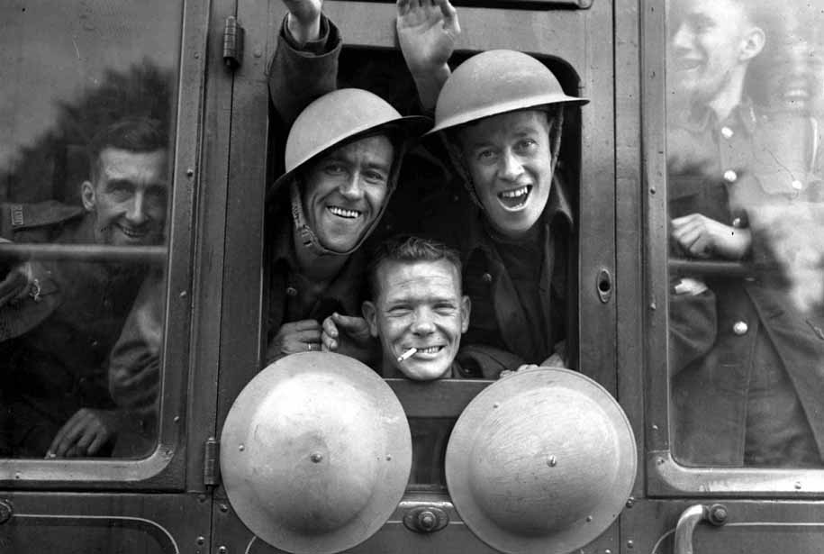

<h1>100-Days-of-ML</h1>

<h2> Day 1 (02-04-2020) : MNIST GAN </h2>

* Today I studied the concept of GAN(Generative Adversarial Network).

* Implemented DCGAN(Deep Convolutional Generative Adversarial Network) on the MNIST dataset to generate handwritten digits.

* I Would love to explore the applications of GAN in the upcoming days.

* Link to the notebook. <a href = "https://github.com/shresth26/100-Days-of-ML/blob/master/DAY-1/Mnist-GAN.ipynb" > Click here. </a>

<h2> References: </h2>

<a href = "https://www.tensorflow.org/tutorials/generative/dcgan"> Deep Convolutional Generative Adversarial Network (Tensorflow doc) </a>

<a href = "https://medium.com/@jonathan_hui/gan-whats-generative-adversarial-networks-and-its-application-f39ed278ef09"> What is Generative Adversarial Networks GAN? </a>

<h2> Day 2 (03-04-2020) : Regularization and Optimization </h2>

* Studied various regularization techniques in order to handle overfitting.

* Completed Week 1 assignment of the Andrew Ng Deep Learning course.

* Explored various optimization algorithms such as Gradient descent with momentum, RMSprop and Adam.

* Completed Week 2 assignment of the same course.

* Course link : <a href = "https://www.coursera.org/learn/deep-neural-network?specialization=deep-learning"> Click here </a>

<h2> Day 3 (04-04-2020) : FACE-GAN </h2>

* Implemented DCGAN(Deep Convolutional Generative Adversarial Network) on the face dataset to generate human faces.

* The image generated was not upto the mark and would need some modification.

* The dataset is available <a href = "https://www.kaggle.com/gasgallo/faces-data-new" > Here </a>

* Link to the notebook is available <a href = "https://github.com/shresth26/100-Days-of-ML/blob/master/DAY-3/Face_Gan.ipynb" >        here </a>

<h2> Day 4 (05-05-2020) : Structural Machine Learning </h2>

* Learnt about Machine Learning structural strategies used in the industry.

* Read about terms like Avoidable bias and variance on the dataset and about Bayes error.

* Read about Transfer Learning, Multi-task learning and end-to-end deep learning.

* Completed the course 3 of the deep learning series by Andrew Ng.

<h2> Day 5 (06-05-2020) : Clustering in Machine Learning </h2>

* Today I studied about the various clustering algorithms used in ML.

* The list includes : K-means, Mean-shift, Density-Based Spatial Clustering of Applications with Noise (DBSCAN), Gaussian Mixture Models (GMM) and Agglomerative Hierarchical Clustering.

* Analysed the pros and cons of each algorithm and the applications of each of them.

* Looking forward to implement them in the coming days.

* Relevant links on the topic. <a href = "https://towardsdatascience.com/unsupervised-machine-learning-clustering-analysis-d40f2b34ae7e" > Link 1 </a>
  <a href = "https://towardsdatascience.com/the-5-clustering-algorithms-data-scientists-need-to-know-a36d136ef68" > Link 2</a>
   <a href = "https://www.analyticsvidhya.com/blog/2016/11/an-introduction-to-clustering-and-different-methods-of-clustering/" > Link 3 </a>

<h2> Day 6 (07-04-2020) : Convolution </h2>

* Today I started course 4 of the Deep Learning Series by deeplearning.ai

* Week 1 turned out to be a quick recap of Convolution Neural Network (CNN).

* The topics covered today included padding, strides, convolutions and MaxPooling.

* The course is available <a href = "https://www.coursera.org/learn/convolutional-neural-networks?specialization=deep-learning " > Here. </a>

<h2> Day 7 (08-04-2020) : Colorization </h2>

* Today I worked on the conversion of black images to images of color.

* Used OpenCV and Deep Learning to implement the program.

* The model used was pre-trained on the Caffe deep learning framework on ImageNet dataset.

* You can refer to the paper <a href = "https://arxiv.org/pdf/1603.08511.pdf" > here </a> and to the documentation <a href = "https://github.com/richzhang/colorization" > here </a>

* The results were plausible.

 

<h2> Day 8 (09-04-2020) : Background of CNN </h2>

* Today I dived deeper into the background of CNN.

* I wrote the code for it to understand what happens behind the scenes.

* It's always good to know about the theory and code of the pre-defined functions used directly by us.

* I implemented the model on the 'signs' dataset.

<h2> Day 9 (10-04-2020) : PyTorch </h2>

* Today I started learning about the basics of the PyTorch deep learning framework.

* Looked up the differences between Tensorflow and PyTorch.

* Implemented the framework on the University of California car dataset.

* Here's the notebook for it. 

<h2> Day 10 (11-04-2020) : ResNet and Inception </h2>

* Today I started Week 2 of the fourth course in the Deep learning specialization.

* Various architectures like ResNet, AlexNet and Inception were discussed in detail.

* Read about the effectiveness of 1x1 convolution.

* Would soon read the research papers on these architectures.

<h2> Day 11 (12-04-2020) : CIFAR10 Pytorch </h2>

* Today I implemented the CIFAR 10 dataset using Pytorch.

* The accuracy was not upto the mark since my primary focus was on understanding the framework.

* Would tweak the hyperparameters and increase the number of epochs to achieve higher accuracy.

* Would implement Pytorch on different datasets as well in the coming days.

* You can find the notebook <a href = "https://github.com/shresth26/100-Days-of-ML/blob/master/DAY-11/CIFAR_Torch.ipynb" > here. </a>

<h2> Day 12 (13-04-2020) : Math for Machine Learning </h2>

* Today I studied the required mathematics for machine learning.

* The topics included Linear Algebra, Multivariate Calculus, Probability and Calculus.

* The YouTube video for it is available <a href = "https://www.youtube.com/watch?v=1VSZtNYMntM" > here. </a>

<h2> Day 13 (14-04-2020) : K-means Implementation </h2>

* Today I worked on the analysis of Mall Customer Segmentation data on Kaggle.

* The analysis involved the comparison between parameters like Customer age, salary and gender.

* K-means algorithm was used to form a cluster of customers on the basis of their shopping traits.

* The notebook is available <a href = 'https://github.com/shresth26/100-Days-of-ML/blob/master/DAY-13/K-means.ipynb' > here. </a>

<h2> Day 14 (15-04-2020) : Time Series Analysis </h2>

* Today I read the theory of time series analysis and its applications.

* I was fascinated to know that time series analysis has a different approach as compared to conventional ML algorithms.

* The applications of time series really intrigued me and would implement it in the coming days.

* Relevant links.

  <a href = 'https://blogs.oracle.com/datascience/7-ways-time-series-forecasting-differs-from-machine-learning'> 7 Ways Time Series Forecasting Differs from Machine Learning </a>

  <a href = "https://machinelearningmastery.com/time-series-forecasting/" > What Is Time Series Forecasting? </a>

<h2> Day 15 (16-04-2020) : Basics of ML Libraries </h2>

* Completed the assignment 1 for SHALA2020 course.

* The assignment was an introduction to important libraries like Numpy, Pandas and Matplotlib.

* The notebook is available <a href = 'https://github.com/shresth26/SHALA2020/blob/master/Assignment1.ipynb'> here </a>

<h2> Day 16 (17-04-2020) : Introductory Statistics </h2>

* Revised statistic concepts assigned under the pre-work category on SHALA course.

* Consisted of topics like measuring central tendency, histograms and statistic fundamentals.

* Eventually gave a quiz on the related topic.

* Relevant links.

  <a href ='https://statistics.laerd.com/statistical-guides/measures-central-tendency-mean-mode-median.php' > Measures of Central Tendency </a>

  <a href = 'https://www.youtube.com/watch?v=SzZ6GpcfoQY'> Statistic fundamentals </a>

  <a href = 'https://www.youtube.com/watch?v=qBigTkBLU6g'> Histograms </a>

<h2> Day 17 (18-04-2020) : Plotting </h2>

* Completed assignment 2 of the IITB Shala course.

* Plotted and analysed data using Histograms, boxplots and pie chart.

* The notebook can be accessed <a href = 'https://github.com/shresth26/SHALA2020/blob/master/Assignment-2/Assignment2.ipynb' > here. </a>

<h2> Day 18 (19-04-2020) : Airline Passenger Prediction </h2>

* Predicted the airline traffic for the future(3 years) using time series analysis using fbProphet.

* Used Markov Chain Monte Carlo method(MCMC) to generate forecasts.

* The model shows both the seasonality and trend in the data.

* You can check out the notebook <a href = 'https://github.com/shresth26/100-Days-of-ML/blob/master/DAY-18/Passenger_Prediction.ipynb'> here. </a>

<h2> Day 19 (20-04-2020) : Milk Production Prediction </h2>

* Predicted the milk production for the future(3 years) using time series analysis using fbProphet.

* Used Markov Chain Monte Carlo method(MCMC) to generate forecasts.

* The model shows both the seasonality and trend in the data.

* You can check out the notebook <a href = 'https://github.com/shresth26/100-Days-of-ML/blob/master/DAY-19/Milk_Production.ipynb' > here. </a>

<h2> Day 20 (21-04-2020) : Graphs and Charts </h2>

* Read the theory of different types of graphs and their uses.

* Studied the differences between the types of graphs and charts.

* Learnt several visualization practices.

* Relevant links.

  <a href = 'https://chartio.com/learn/charts/essential-chart-types-for-data-visualization/'> Essential Chart Types for Data Visualization </a>

  <a href = 'https://visme.co/blog/types-of-graphs/'> Types of Graphs </a>

<h2> Day 21 (22-04-2020) : Graphs Implementation </h2>

* Completed assignment 2 of the IITB Shala course.

* The assignment consisted of different kind of charts and graphs that can be made using libraries like Pandas, Matplotlib and Seaborn.

* Explored various other visualization techniques as well.

* You can access the assignment <a href = 'https://github.com/shresth26/SHALA2020/blob/master/Assignment_3.ipynb'> here. </a>

<h2> Day 22 (23-04-2020) :  Intermediate Statistics </h2>

* Read a lot of intermediate statistics concepts.

* Topics included Maximum likelihood estimation, sufficient statistics, null hypothesis testing, t-test and Wilcoxon rank test.

* Would implement these concepts in the future.

  Relevant Links:

  <a href = 'https://www.youtube.com/watch?v=XepXtl9YKwc'> Maximum Likelihood </a>

  <a href = 'https://statistics.laerd.com/statistical-guides/hypothesis-testing.php'> Hypothesis Testing </a>

  <a href = 'https://towardsdatascience.com/statistical-tests-when-to-use-which-704557554740'> Statistical Tests </a>

<h2> Day 23 (24-04-2020) : Statistics Assignment </h2>

* Completed assignment 4 of the SHALA IITB course.

* With this the module 1 (Data Science) of the course has been completed.

* Computed the likelihood and log likelihood from samples that were drawn from an exponential distribution.

* Performed a two sample t-test from samples of unknown distributions and found the critical value.

* Notebook is available <a href = 'https://github.com/shresth26/SHALA2020/blob/master/Assignment_4.ipynb'> here. </a>

<h2> Day 24 (25-04-2020) : Car Detection using YOLO </h2>

* Started week 3 of the CNN course by deeplearning.ai

* Read about object localization, object and landmark detection and non-max suppression.

* Studied the YOLO algorithm and implemented it in the week's assignment.

* Was able to complete the assignment and detect cars.

<h2> Day 25 (26-04-2020) : Neural Style Transfer </h2>

* Started Week 4 of the CNN deeplearning.ai course

* The topic for the week was art generation with neural style transfer.

* Understood the 2 types of cost functions i.e. Content cost function and Style cost function.

* Completed the assignment for art generation.

